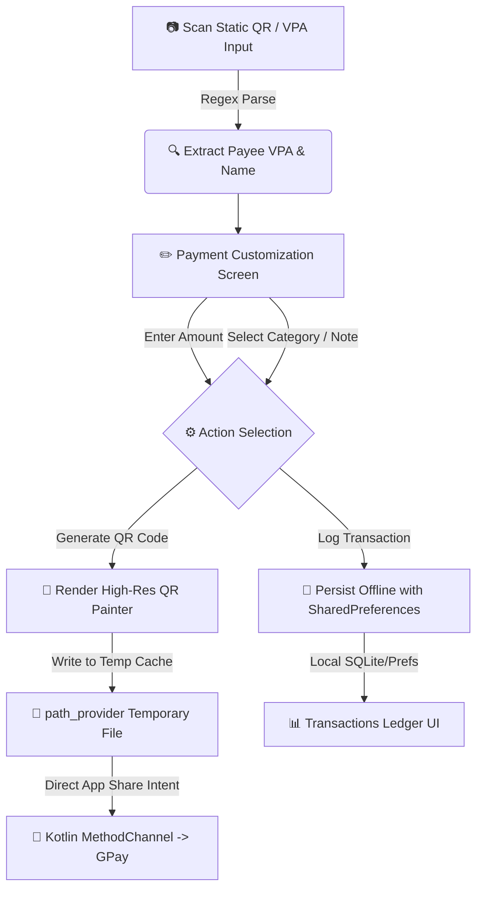

# 🛰️ Intercept — Dynamic UPI QR Code Interceptor & Customizer

[](https://flutter.dev)
[](https://dart.dev)
[](#)
[](#)

**Intercept** is a sleek, privacy-first Flutter utility designed to intercept static UPI (Unified Payments Interface) QR codes or VPAs (Virtual Payment Addresses), customize them with payment parameters (amounts, transaction categories, and custom notes), and instantly generate + directly share dynamic, pre-filled QR codes to Google Pay or save them in a local offline ledger.

Instead of making payments directly on the scanner's device right away without context, **Intercept** acts as an intermediary tool for merchant invoicing, bill-splitting, payment link forwarding, and transaction cataloging.

---

## 📸 Core App Flow



---

## ✨ Key Features

*   **⚡ Intelligent Scan & Parse**: Immediately scans QR codes using `mobile_scanner`. Supports standard NPCI UPI scheme formats (`upi://pay?pa=...`) and handles fallback queries (direct VPAs like `name@bank`).
*   **🎨 Custom Payment Parameterization**: 
    *   Dynamic amount input (₹) with real-time field validation.
    *   Sleek horizontal swipe categorization chips (`Food`, `Travel`, `Groceries`, `Shopping`, `Utilities`, `Entertainment`, `Other`).
*   **🪄 Dynamic QR Generator (`qr_flutter`)**: Generates high-contrast, gapless payment QR codes conforming to the official UPI deep-linking specification (with `mc` and `am` parameters).
*   **📤 Direct GPay Image Sharing (`MethodChannel`)**: Bypasses the standard OS share sheet! It generates the QR image, stores it safely in a temporary cache (`path_provider`), and triggers a specialized `ACTION_SEND` intent targeted directly at the Google Pay package (`com.google.android.apps.nbu.paisa.user`) to ensure PSP compatibility.
*   **💾 Offline Ledger & History**: A local transaction journal that saves payee details, amounts, categories, and date stamps inside local persistent storage (`shared_preferences`).
*   **💎 Premium Dark UI**: Follows a modern dark-mode palette seeded with a gorgeous Indigo core hue (`#6200EA`), custom gradients, soft shadows, and clean modern typography.

---

## 🛠️ Technical Stack & Packages

| Package | Purpose | Version |
|:---|:---|:---:|
| [**`mobile_scanner`**](https://pub.dev/packages/mobile_scanner) | High-performance, hardware-accelerated camera scanner | `^7.2.0` |
| [**`qr_flutter`**](https://pub.dev/packages/qr_flutter) | High-resolution vector and raster QR code rendering | `^4.1.0` |
| [**`share_plus`**](https://pub.dev/packages/share_plus) | Used for FileProvider configurations internally | `^13.1.0` |
| [**`shared_preferences`**](https://pub.dev/packages/shared_preferences) | Key-value persistent offline storage (transaction ledger) | `^2.5.5` |
| [**`path_provider`**](https://pub.dev/packages/path_provider) | Safe directory access for caching generated PNG files | `^2.1.5` |
| [**`url_launcher`**](https://pub.dev/packages/url_launcher) | Auxiliary deep-linking support for direct payment apps | `^6.3.2` |

---

## ⚙️ Native Configuration Guide

To enable QR scanning and UPI link resolution on mobile hardware, the following platform-specific parameters are configured in the project:

### 🤖 Android Setup

1.  **Camera Permissions**: Configured in `android/app/src/main/AndroidManifest.xml` to allow QR scanning:
    ```xml
    <uses-permission android:name="android.permission.CAMERA" />
    ```

2.  **Package Visibility Queries**: Added to `AndroidManifest.xml` to query the operating system for packages capable of handling custom `upi://` schemes (complying with Android 11+ visibility guidelines):
    ```xml
    <queries>
        <!-- Text Selection Handler -->
        <intent>
            <action android:name="android.intent.action.PROCESS_TEXT"/>
            <data android:mimeType="text/plain"/>
        </intent>
        <!-- UPI Apps Handler -->
        <intent>
            <action android:name="android.intent.action.VIEW" />
            <data android:scheme="upi" />
        </intent>
        <intent>
            <action android:name="android.intent.action.VIEW" />
            <data android:scheme="tez" />
        </intent>
    </queries>
    ```

### 🍎 iOS Setup

1.  **Camera Usage Description**: Configured in `ios/Runner/Info.plist` to describe the reason for camera permissions:
    ```xml
    <key>NSCameraUsageDescription</key>
    <string>This app needs camera access to scan QR codes</string>
    ```

2.  **Deep Link Query Schemes**: Added to `Info.plist` to declare that Intercept needs to query for the presence of the `upi` URL scheme:
    ```key
    <key>LSApplicationQueriesSchemes</key>
    <array>
        <string>upi</string>
        <string>tez</string>
    </array>
    ```

---

## ⚡ UPI URI Scheme Specification

The dynamic QR generated by Intercept matches the official NPCI specification format:

```text
upi://pay?pa={payee_vpa}&pn={payee_name}&am={amount}&cu=INR&tn={category_note}
```

*   `pa`: Payee Virtual Private Address (VPA) / UPI ID (e.g., `merchant@okaxis`)
*   `pn`: Payee registered legal name (e.g., `Store Name`)
*   `am`: Decimal transaction amount (e.g., `250.00`)
*   `cu`: Currency code (hardcoded to `INR`)
*   `tn`: Transaction note / category metadata (e.g., `Groceries`)

---

## 🚀 Getting Started & Execution

### Prerequisites
*   [Flutter SDK](https://docs.flutter.dev/get-started/install) (`>= 3.11.5`)
*   Dart SDK (`^3.11.5`)
*   Android SDK / Xcode (for emulation/physical deployments)

### Setup & Run
1.  **Clone the repository & navigate to target directory**:
    ```bash
    cd intercept
    ```

2.  **Fetch project dependencies**:
    ```bash
    flutter pub get
    ```

3.  **Run static analysis checks**:
    ```bash
    flutter analyze
    ```

4.  **Run the application**:
    *   For development/debug run:
        ```bash
        flutter run
        ```
    *   To target a specific device:
        ```bash
        flutter run -d <device-id>
        ```

---

## 🧪 Testing Notes

> [!WARNING]
> The current `test/widget_test.dart` file contains the boilerplate counter smoke test. Because this project has been fully migrated to a camera scanner and payment generator interface, running `flutter test` will result in test failures due to missing UI components (like the counter and incremental button). 
>
> To implement UI tests, configure mock scanners and mock platform channels for `shared_preferences` and `mobile_scanner`.

---

## 🛣️ Future Roadmap

*   **🧾 OCR Bill Scanner**: Read static physical receipts and automatically split them into customizable UPI QRs for different group members.
*   **🔗 UPI Deep Links Launching**: Add a direct button to invoke native UPI apps (Google Pay, PhonePe, Paytm) installed on the device directly instead of solely sharing the QR.
*   **📊 Transaction Analytics**: Render detailed charts and reports based on categories logged in the ledger.
*   **🔑 Secure Biometrics**: Secure the transaction ledger view and payment details screen with FaceID / fingerprint scanner integration.
